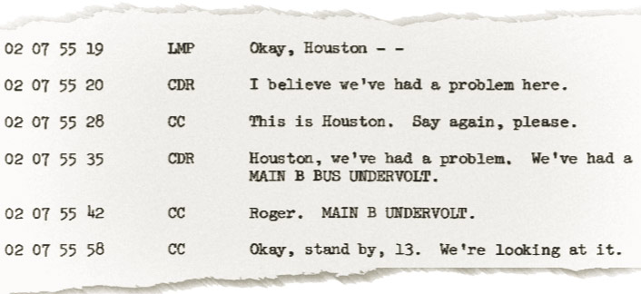
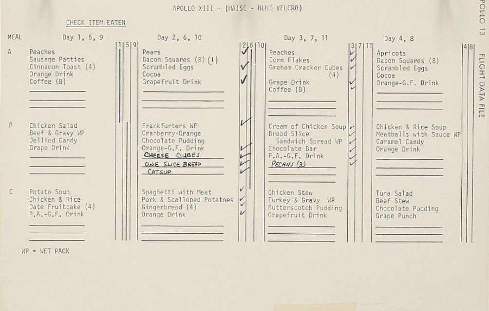
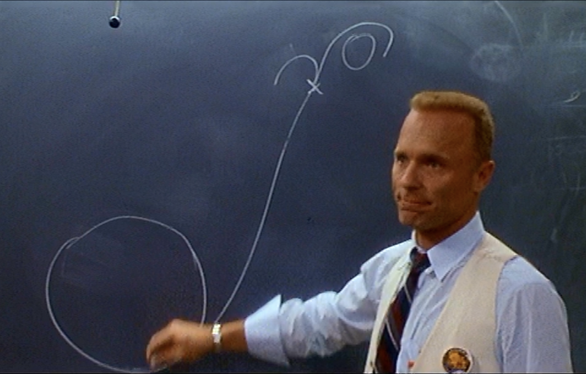
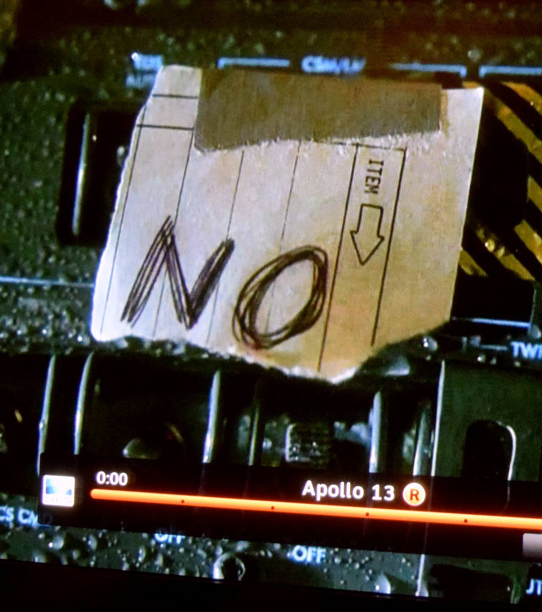
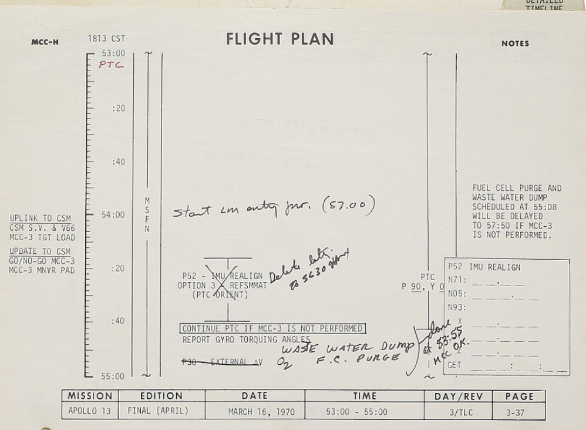

## Training failing 
We have thought for a while now that, training is a fail,  and that everything wrong with training will be worse when done remotely. 

## Have you ever had the thought that 
* Training is too often either obvious or irrelevant, and remotely people can look it up on YouTube
* Training often fails to be memorable- remote learning is all 'on the screen', so there is even less to remember, which can result in less being remembered.
* Training is boring - click this click that, something happens or doesn't - with no real reason why. Do this remotely, and there is nothing to stop people tuning out and doing their email.

So let's fix this because failure to work productively remotely is not really working at all.

## For a start lets not do training its adoption

We provide an immersive adoption experience; where groups of people enter a  immersive dramatic scenario and acquire new ways of working as part of an engaging story. 

## So how do you adopt Microsoft Teams?

We use the story of the Apollo 13 mission, its the one where the astronaut says "Houston we have a problem."

With the Apollo 13 mission as a backdrop, users live and learn the fundamentals of Microsoft Teams, Planner and Document Collaboration. We selected content that focuses on helping users with the things they find most challenging. 

Here is a list of course content - to show you how we weave together the learning goals with a memorable story:

* Channels to manage the different concurrent collaboration activities - Houston and the Astronauts have a channel, and there will need to be another one so that the engineers can work collaboratively

* Chat - how else to communicate with the astronauts in real-time.

* Document sharing - it's going to be vital to share documents, specifications, and collaborate upon them in real-time. 
* Planner  - Task management is going to be crucial; users will get a chance to try out which work best. 

* Whiteboard - obviously

* Forms something like this?

* Wiki or OneNote-  What better methods could there be for collaboratively capturing lessons learned as you have them.  This is how they did back then:

* We will also make use of Microsoft streams to host clips of the film to set the scene 
* Guest access so that manufacturers and journalists can communicate.

